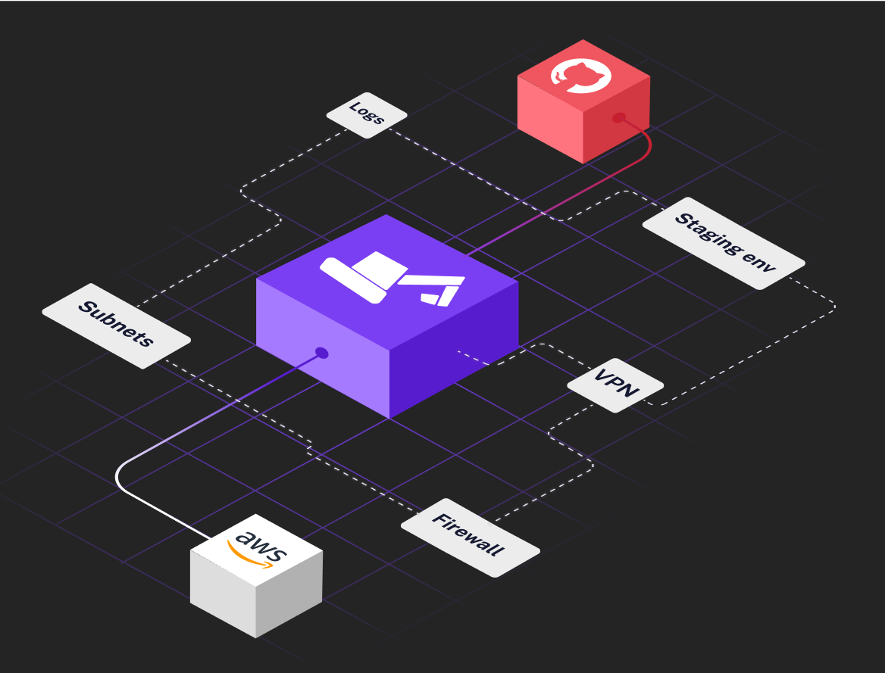

# What is this?

These are the terraform files that define your infrastructure. It was generated using [digger](https://digger.dev). These configurations files will 
help you set up your environment on AWS in no time!

# How to run it?

## On your machine

## In a CI system

CI documentation coming soon

# Next steps

After you set up your infrastructure the next steps is to deploy your application. 

```
```

# Troubleshooting and getting help


